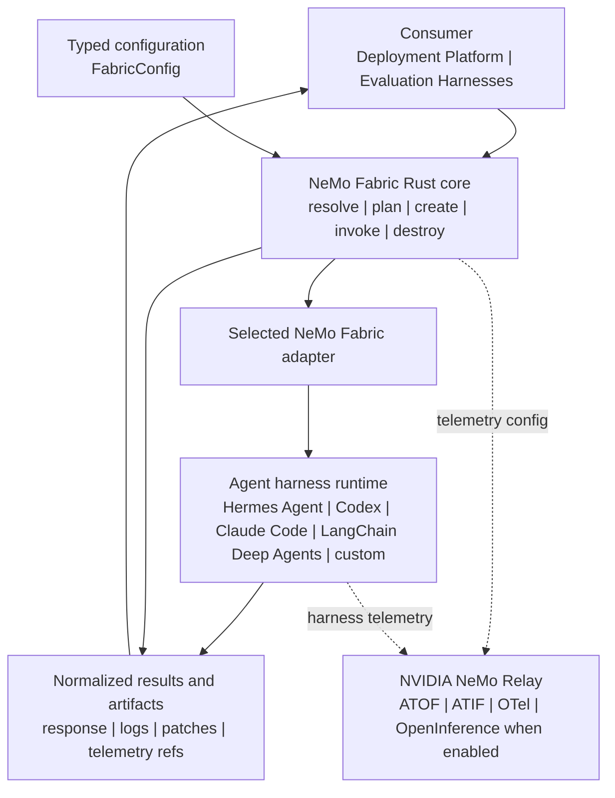

<!--
SPDX-FileCopyrightText: Copyright (c) 2026, NVIDIA CORPORATION & AFFILIATES. All rights reserved.
SPDX-License-Identifier: Apache-2.0
-->

# NVIDIA NeMo Fabric

[](https://github.com/NVIDIA/NeMo-Fabric/blob/main/LICENSE)
[](https://github.com/NVIDIA/NeMo-Fabric/)
[](https://github.com/NVIDIA/NeMo-Fabric/releases)
[](https://pypi.org/project/nemo-fabric/)
[](https://crates.io/crates/nemo-fabric-core)
[](https://crates.io/crates/nemo-fabric-cli)

<p align="center">
  
</p>

NeMo Fabric gives users one configurable, observable way to run applications
across multiple agent harnesses. It standardizes configuration, lifecycle
management, and results without requiring a separate integration for every harness.

NeMo Fabric lets you change harnesses without rebuilding each integration,
isolate conflicting runtime dependencies, and manage harness configuration,
execution, and observability consistently. Every run returns normalized
results, artifacts, and telemetry for downstream systems to consume.

It provides:

- a versioned, typed configuration contract;
- ordinary Python composition for experiment variants;
- adapter integrations for harness-specific launch and control;
- a Python SDK backed by the Rust core;
- normalized run results, artifact manifests, and telemetry references.

## Supported Harnesses

NeMo Fabric provides the following harness integrations. The package
expressions install the components shown in each column:

| Agent Harness | Runtime, Adapter, and Harness | Adapter and Harness | Adapter Only |
| --- | --- | --- | --- |
| [Claude Code](docs/integrations/harness/claude.mdx) | `nemo-fabric[claude]` | `nemo-fabric-adapters-claude[harness]` | `nemo-fabric-adapters-claude` |
| [Claude Code CLI](docs/integrations/harness/claude-code-cli.mdx) | `nemo-fabric[claude-code-cli]` | `nemo-fabric-adapters-claude-code-cli[harness]` | `nemo-fabric-adapters-claude-code-cli` |
| [Codex](docs/integrations/harness/codex.mdx) | `nemo-fabric[codex]` | `nemo-fabric-adapters-codex[harness]` | `nemo-fabric-adapters-codex` |
| [Codex CLI](docs/integrations/harness/codex-cli.mdx) | `nemo-fabric[codex-cli]` | `nemo-fabric-adapters-codex-cli[harness]` | `nemo-fabric-adapters-codex-cli` |
| [Hermes Agent](docs/integrations/harness/hermes.mdx) | `nemo-fabric[hermes-agent]` | `nemo-fabric-adapters-hermes[harness]` | `nemo-fabric-adapters-hermes` |
| [LangChain Deep Agents](docs/integrations/harness/deepagents.mdx) | `nemo-fabric[deepagents]` | `nemo-fabric-adapters-deepagents[harness]` | `nemo-fabric-adapters-deepagents` |

The `nemo-fabric` package always installs the runtime, and each root harness
extra adds the corresponding adapter and supported harness. Use the
adapter-package forms for split environments or environments that already
manage the harness. For `harness`, `full`, and Relay behavior, refer to the
[installation guide](docs/getting-started/install.mdx).

Capabilities vary by harness. Review the compatibility matrix and use plan()
and doctor() before relying on optional capabilities such as MCP, skills,
blocked tools, subagents, or telemetry.

## Supported Platforms

NeMo Fabric supports the following platforms:

* Linux (x86_64, arm64)
* macOS (arm64)
* Windows (x86_64)

## Quick Start

The following example runs NeMo Fabric, the Hermes Agent adapter, and Hermes
Agent in one Python environment.

### Install NeMo Fabric and Hermes Agent

Hermes Agent supports Python 3.11 through 3.13. With a supported Python
version, create and activate a virtual environment, then install the required
packages:

```bash
python -m venv .venv
source .venv/bin/activate
pip install "nemo-fabric[hermes-agent]"
```

### Set the API Key

Create an API key in the [NVIDIA API Catalog](https://build.nvidia.com/), then
set the `NVIDIA_API_KEY` environment variable:

```bash
export NVIDIA_API_KEY="<your-api-key>"
```

### Run Hermes Agent

Run the following Python example:

```python
import asyncio

from nemo_fabric import (
    Fabric,
    FabricConfig,
    HarnessConfig,
    MetadataConfig,
    ModelConfig,
    RuntimeConfig,
)

config = FabricConfig(
    metadata=MetadataConfig(name="quickstart-agent"),
    harness=HarnessConfig(adapter_id="nvidia.fabric.hermes"),
    runtime=RuntimeConfig(max_turns=1),
    models={
        "default": ModelConfig(
            provider="nvidia",
            model="nvidia/nemotron-3-nano-omni-30b-a3b-reasoning",
            api_key_env="NVIDIA_API_KEY",
            base_url="https://integrate.api.nvidia.com/v1",
        )
    },
)

result = asyncio.run(Fabric().run(config, input="Who are you?"))
print(result.output.response)
```

`HarnessConfig.adapter_id` selects the Hermes Agent adapter. To use another
supported harness, install its package extra and set the corresponding adapter
ID. Pass harness-specific options through `HarnessConfig.settings` only when
the selected adapter descriptor declares them in `settings_schema`. Adapters
that expose selectable executables can accept `FabricConfig.workflow`; the
descriptor's `workflow_schema` defines and validates that adapter-owned block.

For a guided version of this example, refer to the
[`01_quickstart.ipynb` notebook](examples/notebooks/01_quickstart.ipynb). The
[example notebooks overview](examples/notebooks/README.md) describes the other
available notebooks.

## Deployment Scenarios

### Scenario 1: Runtime and Harness in the Same Environment

This is the simplest deployment. The `nemo-fabric` package, selected adapter,
and supported harness share one Python environment. The quick start above uses
this model with `nemo-fabric[hermes-agent]`.

### Scenario 2: Isolated Sandbox for Task Execution

This is the Harbor deployment model. The Harbor host constructs and serializes
the final typed `FabricConfig`. Harbor then installs and runs NeMo Fabric, the
selected adapter, and the harness inside an isolated task environment such as a
Docker container or Daytona sandbox. Adapter discovery and task-path resolution
occur inside that sandbox.

Install `nemo-fabric[harbor]==0.2.0` in the host environment. Install a complete
harness composition such as `nemo-fabric[claude]==0.2.0` or
`nemo-fabric[hermes-agent,relay]==0.2.0` in the task environment. For Claude or
Codex Relay streaming, also provision the external NeMo Relay CLI in the task
environment. Refer to the
[Harbor execution model](examples/harbor/README.md#execution-model) for details.

### Scenario 3: Runtime and Harness in Separate Python Environments

NeMo Fabric can run the runtime and agent harness in separate, locally
accessible Python environments. This setup isolates their Python dependencies
while the runtime launches the adapter through the adapter environment's
interpreter.

Create an environment for the NeMo Fabric runtime:

```bash
python -m venv .venv-fabric
source .venv-fabric/bin/activate
pip install nemo-fabric==0.2.0
```

Create another environment for the adapter and harness. For example, install
the Hermes Agent integration:

```bash
python -m venv .venv-hermes
source .venv-hermes/bin/activate
pip install "nemo-fabric-adapters-hermes[harness]==0.2.0"
```

The adapter package keeps this environment independent from the
`nemo-fabric` distribution. Its `harness` extra installs the compatible Hermes
Agent dependency alongside the adapter. Use matching NeMo Fabric release
versions for the runtime and adapter package unless a different pairing has
been explicitly validated.

Run NeMo Fabric from its environment and set `ADAPTER_PYTHON` to the interpreter
that contains the adapter and harness:

```bash
source .venv-fabric/bin/activate
export ADAPTER_PYTHON="$PWD/.venv-hermes/bin/python"
```

For package options and platform-specific instructions, refer to the
[installation guide](docs/getting-started/install.mdx).

## Execution Flow

The following diagram shows how configuration moves through the core and
selected adapter to the harness, normalized results, artifacts, and telemetry:



## Next Steps

### Learn and Experiment

Use the following resources to learn about NeMo Fabric:

- [Example Notebooks](examples/notebooks/README.md) provide a guided tour of the Python SDK.
- [Python SDK guide](docs/sdk/python.mdx): typed configuration, planning,
  diagnostics, requests, multi-turn runtimes, NeMo Relay streaming,
  parallelism, results, and errors.
- [Experimentation CLI](docs/experimentation/cli.mdx): presets, maintained
  examples, editable application scaffolds, and explicit non-goals.
- [Getting Started overview](docs/about-nemo-fabric/overview.mdx): interface
  selection and the end-to-end NeMo Fabric workflow.

### Consumer Integrations

Consumer integrations are northbound: they connect applications, evaluation
systems, and platforms to NeMo Fabric through its public interfaces. Use the
following resources to build or validate a consumer integration:

- [Consumer integration skills](skills/README.md) provide repository-local
  coding-agent workflows for integrating NeMo Fabric into an application
  through the Python SDK.
- The [Harbor integration](docs/integrations/consumer/harbor.mdx) explains
  how to validate the integration with a deterministic, credential-free
  calculator verification test. You can also run the same task with Hermes
  Agent or Claude and evaluate coding tasks with SWE-Bench.

### Harness Integrations

Harness integrations are southbound: they connect NeMo Fabric to agent harnesses
through adapters. Use the following reference to compare the integrations:

- [Adapter compatibility and guides](adapters/README.md): compare bundled
  harness support, runtime ownership, telemetry integration, and package guides.

## Roadmap

- **Custom harnesses:** Publish the NeMo Fabric adapter contract so third-party
  developers can build integrations that are compatible with NeMo Fabric.
  Support integrations maintained by NeMo Fabric and compatible third-party
  integrations.
- **Custom agents:** Support custom agents built on maintained or third-party
  harness integrations without requiring an additional, agent-specific adapter.
  Preserve the normalized NeMo Fabric lifecycle, results, artifacts, and
  telemetry.
